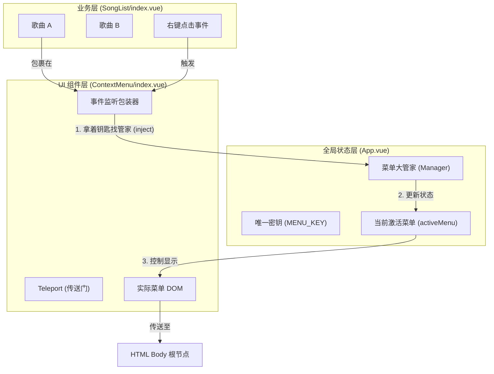

# 全局右键菜单系统设计文档 (Global Context Menu Design)

本文档详细解析了 `Music App` 中的右键菜单系统实现。该系统采用了 **单例模式 (Singleton)** 配合 Vue 3 的 **依赖注入 (Provide/Inject)** 机制，解决了复杂列表场景下的菜单管理难题。

## 1. 核心架构图 (Architecture)

以下架构图展示了各组件之间的数据流向与控制关系：



## 2. 核心代码解析

我们将通过实际代码来剖析这一系统的四大支柱。

### 👮‍♂️ 1. 法则制定者: `useContextMenu.ts`

这里定义了通信的“信物”和状态管理的逻辑。

**文件**: `src/renderer/src/components/ContextMenu/useContextMenu.ts`

```typescript
import { ref } from 'vue'

// 1. 定义唯一信物 (Symbol)，防止命名冲突
const MENU_KEY = Symbol('context-menu-key')

export const useContextMenu = (): any => {
  // 2. 状态：当前哪个菜单是激活的？初始为 null
  const activeMenu = ref(null)

  const setActiveMenu = (menu: any): void => {
    // 3. 核心逻辑：如果已经有别的菜单开着，先把它关掉！
    if (activeMenu.value && activeMenu.value !== menu) {
      // 调用上一个菜单注册进来的 hideMenu 方法
      ;(activeMenu.value as any).hideMenu()
    }
    // 4. 将当前菜单设为激活状态
    activeMenu.value = menu
  }

  return {
    MENU_KEY,
    activeMenu,
    setActiveMenu
  }
}
```

### 👑 2. 掌权者: `App.vue`

`App.vue` 初始化并提供全局状态，是所有子组件的“靠山”。

**文件**: `src/renderer/src/App.vue`

```typescript
import { provide } from 'vue'
import { useContextMenu } from './components/ContextMenu/useContextMenu'

// ...

// 1. 初始化管家
const { MENU_KEY, activeMenu, setActiveMenu } = useContextMenu()

// 2. 下发能力：将管家提供给所有子孙组件
provide(MENU_KEY, { activeMenu, setActiveMenu })
```

### 📦 3. 包装工: `ContextMenu/index.vue`

这是一个通用的 UI 组件，负责显示菜单、注册自己、处理交互。

**文件**: `src/renderer/src/components/ContextMenu/index.vue`

```typescript
// 1. 拿到 App.vue 提供的管家
const menuManager = inject(MENU_KEY) as any

const menuId = ref(Symbol('menu-id')) // 每个实例都有唯一的身份证

// 2. 显示菜单的核心逻辑
const showMenu = (e: any) => {
  e.preventDefault() // 阻止系统原生菜单

  // 检查并关闭其他菜单
  if (menuManager.activeMenu.value) {
    menuManager.setActiveMenu(null)
  }

  // 计算坐标并显示
  x.value = e.clientX
  y.value = e.clientY
  visible.value = true

  // 3. 向管家注册："现在我是激活的，这是我的关闭方法"
  menuManager.setActiveMenu({
    id: menuId.value,
    hideMenu // 这是一个函数: () => { visible.value = false }
  })
}
```

### 🎵 4. 使用者: `SongList/index.vue`

实际的业务场景，只需要简单地包裹一下。

**文件**: `src/renderer/src/components/SongList/index.vue`

```html
<template>
  <div class="list-container">
    <!-- 包裹每一行数据 -->
    <ContextMenu
      v-for="(data, i) in filterList"
      :key="data.id"
      :items="playlistMenuItems"
      @select="(e) => handlePlaylistMenuSelect(e, data)"
    >
      <!-- 实际的歌曲内容 -->
      <div class="list">...由于 ContextMenu 的包装，在这里右键会触发 showMenu...</div>
    </ContextMenu>
  </div>
</template>

<script setup lang="ts">
  // 定义菜单项
  const playlistMenuItems = [
    { label: '评论', value: 'comment' },
    { label: '删除歌曲', value: 'delete' }
  ]

  // 处理具体的点击事件
  const handlePlaylistMenuSelect = (item: any, row: any) => {
    switch (item.value) {
      case 'delete':
        deleteSongHandler(row.id, props.listInfo.id) // 执行真正的业务逻辑
        break
      // ...
    }
  }
</script>
```

---

## 3. 深度流程回放 (Trace Replay)

假设你点击了 **《七里香》** 的右键，然后点击了 **“删除歌曲”**。

1.  **触发 (Trigger)**:
    - 用户在 `SongList` 的某一行点击右键。
    - `ContextMenu` 组件监听到 `@contextmenu` 事件。
2.  **切换 (Switch)**:
    - `ContextMenu` 调用 `inject` 拿到的 `menuManager`。
    - 如果之前 **《晴天》** 的菜单开着，`menuManager` 会调用《晴天》那个组件实例的 `hideMenu()`，强制其 `visible.value = false`。
    - `menuManager` 将当前焦点记录为 **《七里香》**。
3.  **显示 (Render)**:
    - **《七里香》** 的 `ContextMenu` 将 `visible` 设为 `true`。
    - 通过 `<teleport to="body">`，菜单 DOM 被瞬间传送到 `<body>` 根节点下，根据鼠标坐标 `(x, y)` 绝对定位。
4.  **交互 (Interact)**:
    - 用户点击 **“删除歌曲”**。
    - `ContextMenu` 发射 `emit('select', { value: 'delete' })`。
    - `SongList` 收到事件，调用 `handlePlaylistMenuSelect`。
    - `deleteSongHandler` 被执行，歌曲被删除。
5.  **关闭 (Close)**:
    - 选项被点击后，`ContextMenu` 自动调用 `hideMenu()`，菜单消失。

## 4. Why? 设计思考

为什么不直接用一个简单的 `v-if`？或者为什么不用 UI 库自带的？

1.  **性能极佳 (Performance)**:
    - 如果在 `v-for` 中循环 1000 首歌，每个都挂载一个第三方库的 Popover 组件，内存消耗巨大。
    - 本方案中，只有 **当前激活** 的那个菜单才会渲染 DOM（而且是懒加载的）。未激活时，只是挂载了一个轻量级的 `<div>` 监听器。
2.  **逻辑解耦 (Decoupling)**:
    - `SongList` 完全不需要维护“当前哪个菜单开着”这种状态。它只负责“我有这些数据”和“我想显示这些菜单项”。
    - 状态管理全权交给 `App.vue` 和 `useContextMenu`，符合 **单一职责原则**。
3.  **层级无忧 (Layering)**:
    - 利用 Vue 3 的 `Teleport`，菜单永远渲染在最顶层，不会被列表容器的 `overflow: hidden` 或 `z-index` 裁剪遮挡。
