# Music App 数据流向分析（详细版）

## 一、项目整体架构

这是一个基于 **Electron + Vue 3** 的网易云音乐客户端。核心技术栈：

| 技术           | 用途                      |
| -------------- | ------------------------- |
| **Vue 3**      | 前端框架                  |
| **Pinia**      | 全局状态管理（替代 Vuex） |
| **Vue Router** | 页面路由                  |
| **Electron**   | 桌面应用外壳              |
| **Axios**      | HTTP 请求                 |

### 什么是数据流？

简单理解：**数据从哪里来，经过哪些处理，最终到哪里去**。

```
用户操作 → 组件触发 → 调用 API → 更新 Store → 组件响应式刷新
```

---

## 二、项目目录结构导览

```
src/renderer/src/
├── api/             # 📡 API 层：定义所有网络请求
│   ├── musicList.ts # 歌曲、歌单相关接口
│   ├── user.ts      # 用户登录、信息接口
│   └── playlist.ts  # 歌单操作接口
│
├── store/           # 🏪 Store 层：全局状态管理
│   ├── index.ts     # useUserInfo - 用户信息中心
│   ├── music.ts     # useMusicAction - 播放器核心
│   ├── flags.ts     # useFlags - UI开关状态
│   ├── theme.ts     # useTheme - 背景主题
│   └── settings.ts  # useSettings - 用户设置
│
├── components/      # 🧱 组件层：可复用的 UI 组件
│   ├── MusicPlayer/ # 底部播放器
│   ├── MusicDetail/ # 全屏歌词详情页
│   ├── SongList/    # 歌曲列表
│   └── ...
│
├── views/           # 📄 页面层：路由对应的页面
│   ├── Home/        # 首页
│   ├── PlayList/    # 歌单详情页
│   └── ...
│
├── layout/          # 🖼️ 布局层：固定框架组件
│   ├── BaseHeader/  # 顶部导航栏
│   ├── BaseAside/   # 左侧边栏
│   └── BaseBottom/  # 底部播放器容器
│
└── App.vue          # 🚀 应用入口
```

---

## 三、Store 详解（状态仓库）

### 什么是 Store？

Store 就像一个**全局共享的数据仓库**。任何组件都可以：

- **读取** Store 中的数据
- **调用 Action** 修改 Store 中的数据
- 数据变化后，所有使用该数据的组件**自动刷新**

---

### 3.1 useUserInfo（用户信息中心）

📍 **文件位置**：`store/index.ts`

#### State（存储的数据）

| 字段               | 类型       | 说明                     | 示例值                                                |
| ------------------ | ---------- | ------------------------ | ----------------------------------------------------- |
| `profile`          | `object`   | 用户基本信息             | `{ nickname: "张三", avatarUrl: "...", userId: 123 }` |
| `isLogin`          | `boolean`  | 是否已登录               | `true` / `false`                                      |
| `userPlayListInfo` | `array`    | 用户所有歌单（原始数据） | `[{id:1, name:"我喜欢"}, {id:2, name:"工作BGM"}]`     |
| `userLikeIds`      | `number[]` | 红心歌曲的 ID 列表       | `[12345, 67890, 11111]`                               |
| `volume`           | `number`   | 播放器音量（0~1）        | `0.8`                                                 |
| `collapsedState`   | `object`   | 侧边栏折叠状态           | `{ "play": true, "subscribedList": false }`           |

#### Getter（计算属性）

```typescript
// 这是一个"自动计算"的属性，当 userPlayListInfo 变化时会自动重新计算
asideMenuConfig: MenuConfig[]
```

**作用**：将 `userPlayListInfo`（扁平数组）自动分类为：

1. **我喜欢的音乐**（specialType === 5）
2. **创建的歌单**（自己创建的）
3. **收藏的歌单**（subscribed === true）

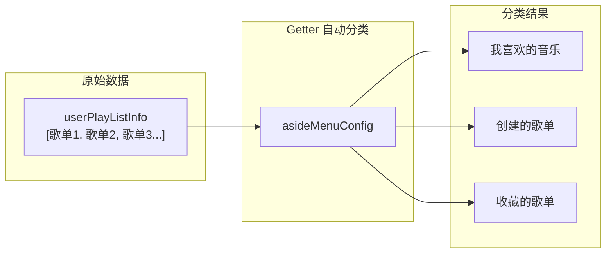

#### Actions（可调用的方法）

| 方法                      | 作用           | 调用时机               |
| ------------------------- | -------------- | ---------------------- |
| `updateProfile(val)`      | 更新用户信息   | 登录成功后             |
| `updateUserPlayList(val)` | 更新歌单列表   | 获取歌单接口返回后     |
| `updateUserLikeIds(ids)`  | 更新红心列表   | 获取喜欢列表接口返回后 |
| `refreshLikedSongs()`     | 刷新红心列表   | 红心/取消红心操作后    |
| `toggleCollapse(mark)`    | 切换折叠状态   | 点击侧边栏折叠按钮后   |
| `loadCache()`             | 从本地缓存加载 | App 启动时             |

---

### 3.2 useMusicAction（播放器核心）

📍 **文件位置**：`store/music.ts`

> [!IMPORTANT]
> 这是整个应用**最核心**的 Store，管理所有音乐播放相关的状态。

#### State（存储的数据）

| 字段              | 类型       | 说明                                     |
| ----------------- | ---------- | ---------------------------------------- |
| `musicUrl`        | `string`   | 当前播放的 MP3 链接                      |
| `currentSong`     | `object`   | 当前歌曲的详细信息（歌名、歌手、封面等） |
| `viewingPlaylist` | `object`   | 用户**正在查看**的歌单（页面上显示的）   |
| `playQueue`       | `object`   | 当前**播放队列**（播放器正在播放的列表） |
| `playQueueIds`    | `number[]` | 播放队列中所有歌曲的 ID                  |
| `lyric`           | `array`    | 解析后的歌词数组                         |
| `currentTime`     | `number`   | 当前播放进度（秒）                       |
| `orderStatusVal`  | `0/1/2`    | 播放模式：0=列表循环，1=随机，2=单曲循环 |
| `index`           | `number`   | 当前歌曲在队列中的索引                   |

> [!CAUTION] > **重要概念区分**
>
> | 概念       | 变量              | 说明                                       |
> | ---------- | ----------------- | ------------------------------------------ |
> | 查看的歌单 | `viewingPlaylist` | 用户点击侧边栏歌单后，页面上**显示**的歌单 |
> | 播放的队列 | `playQueue`       | 播放器**正在播放**的歌曲列表               |
>
> **为什么要区分？**
>
> 用户可以一边**播放**歌单 A 的歌曲，一边**浏览**歌单 B。两者互不干扰。

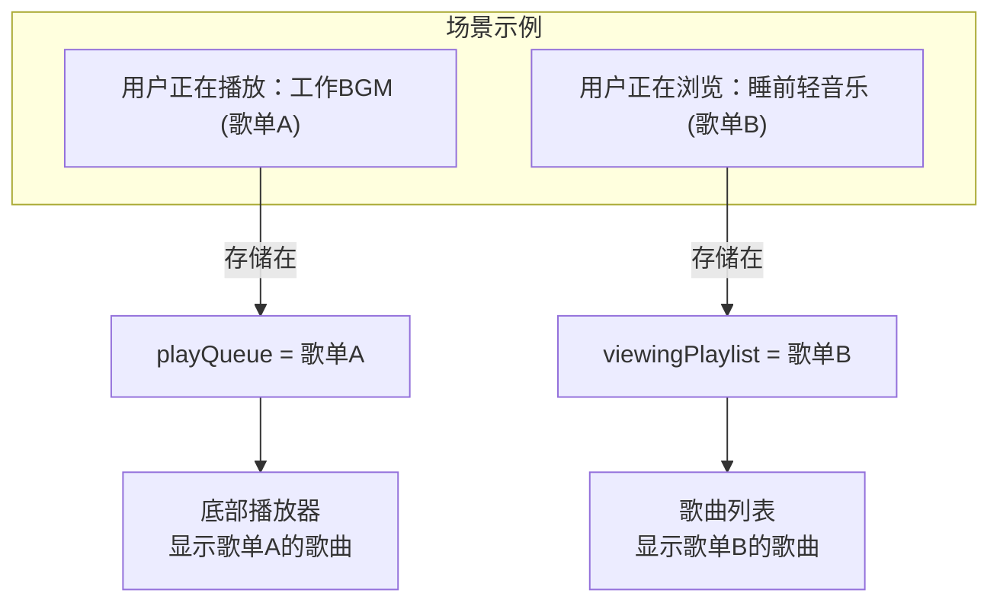

#### Actions（可调用的方法）

| 方法                         | 作用             | 数据流向                  |
| ---------------------------- | ---------------- | ------------------------- |
| `updateViewingPlaylist(val)` | 更新查看的歌单   | API → Store → 页面刷新    |
| `updatePlayQueue(list, ids)` | 更新播放队列     | 歌曲列表 → Store → 播放器 |
| `getMusicUrlHandler(song)`   | 播放指定歌曲     | 触发 API 获取播放链接     |
| `getLyricHandler(id)`        | 获取歌词         | API → Store → 歌词组件    |
| `playEnd()`                  | 歌曲播放结束处理 | 自动切换下一首            |
| `cutSongHandler(target)`     | 手动切歌         | true=下一首，false=上一首 |

---

### 3.3 useFlags（UI 状态开关）

📍 **文件位置**：`store/flags.ts`

这是一个**简单的布尔开关集合**，控制各种 UI 弹窗/抽屉的显示状态。

| 字段           | 说明                 | 受控组件         |
| -------------- | -------------------- | ---------------- |
| `isOpenDetail` | 歌曲详情页是否打开   | `MusicDetail`    |
| `isOpenDrawer` | 播放列表抽屉是否打开 | `PlayListDrawer` |
| `isOpenLogin`  | 登录弹窗是否打开     | `Login`          |
| `isOpenSearch` | 搜索框是否打开       | `Search`         |
| `isMaximize`   | 窗口是否最大化       | 窗口控制按钮     |

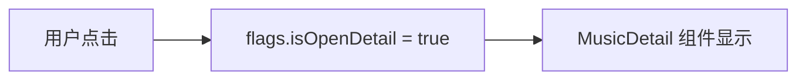

---

### 3.4 useTheme（背景主题）

📍 **文件位置**：`store/theme.ts`

根据当前歌曲封面**提取主色调**，动态更换应用背景。

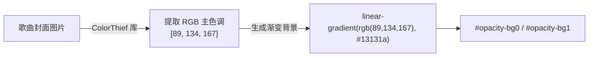

> [!TIP] > **双缓冲技术**：使用两个背景层（`bg0` 和 `bg1`）交替切换，实现平滑过渡效果。

---

### 3.5 useSettings（用户设置）

📍 **文件位置**：`store/settings.ts`

| 字段      | 说明           | 默认值                   |
| --------- | -------------- | ------------------------ |
| `baseUrl` | API 服务器地址 | 从 `.env` 读取           |
| `lyricBg` | 歌词背景模式   | `'rhythm'`               |
| `bold`    | 是否使用粗体   | `true`                   |
| `font`    | 全局字体       | `'Avenir, Helvetica...'` |

---

## 四、核心数据流路径详解

### 路径 1：应用启动初始化

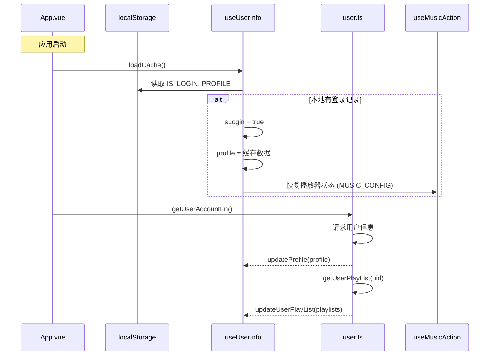

**代码调用链**：

```
App.vue 挂载
  └── store.loadCache()        // 恢复本地缓存
  └── getUserAccountFn()       // utils/userInfo.ts
        ├── getUserAccount()   // API 请求
        ├── updateProfile()    // 更新用户信息
        └── getUserPlayListFn()
              ├── getUserPlayList()   // API 请求歌单
              └── updateUserPlayList() // 更新歌单列表
```

---

### 路径 2：点击歌单 → 渲染歌曲列表

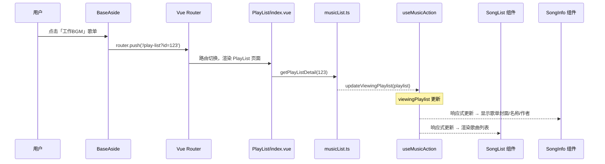

**代码调用链**：

```
BaseAside → itemClick(item)
  └── router.push({ path: '/play-list', query: { id: item.id } })

PlayList/index.vue → watch(route.fullPath)
  └── loadPlaylist(id)
        ├── getPlayListDetail(id)     // API 获取歌单详情
        ├── updateViewingPlaylist()   // 第一次更新（基本信息）
        ├── getMusicDetail(ids)       // API 获取歌曲详情
        └── updateViewingPlaylist()   // 第二次更新（含 tracks）
```

---

### 路径 3：双击歌曲 → 开始播放

这是最复杂的数据流，涉及多个 Store 和组件的协作。

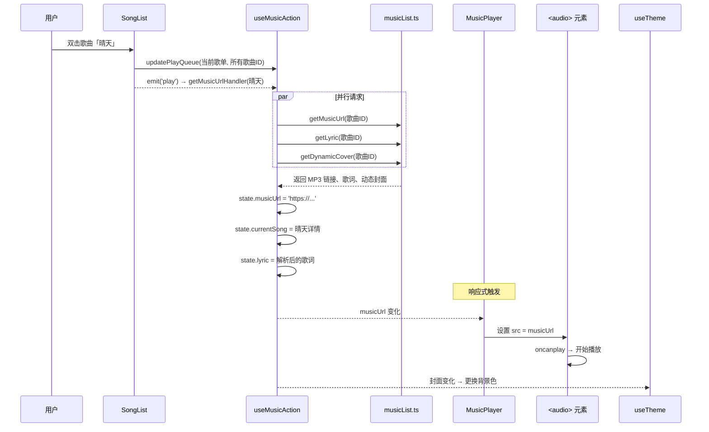

**代码调用链**：

```
SongList → playHandler(song, index)
  ├── music.updatePlayQueue(listInfo, ids)  // 更新播放队列
  └── emit('play', song, index)

PlayList/index.vue
  └── @play="music.getMusicUrlHandler"

music.ts → getMusicUrlHandler(song)
  ├── state.currentSong = song              // 更新当前歌曲
  ├── getLyricHandler(song.id)              // 异步获取歌词
  ├── getDynamicCoverHandler(song.id)       // 异步获取动态封面
  ├── getMusicUrl(song.id)                  // 获取播放链接
  └── window.$audio.el.oncanplay → play()   // 可以播放后开始播放
```

---

### 路径 4：播放器控制

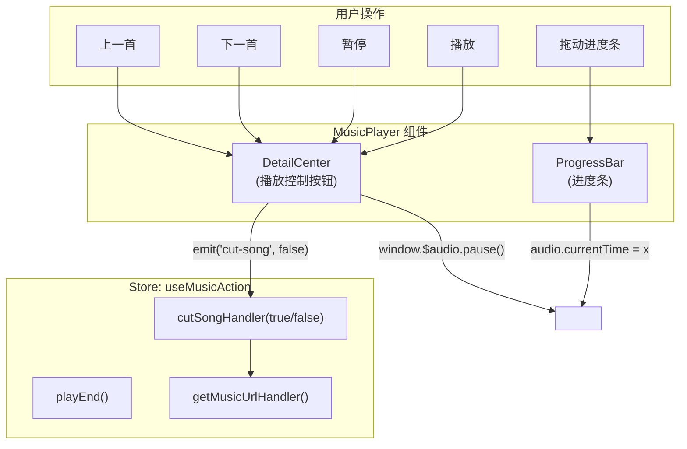

---

### 路径 5：红心喜欢/取消喜欢

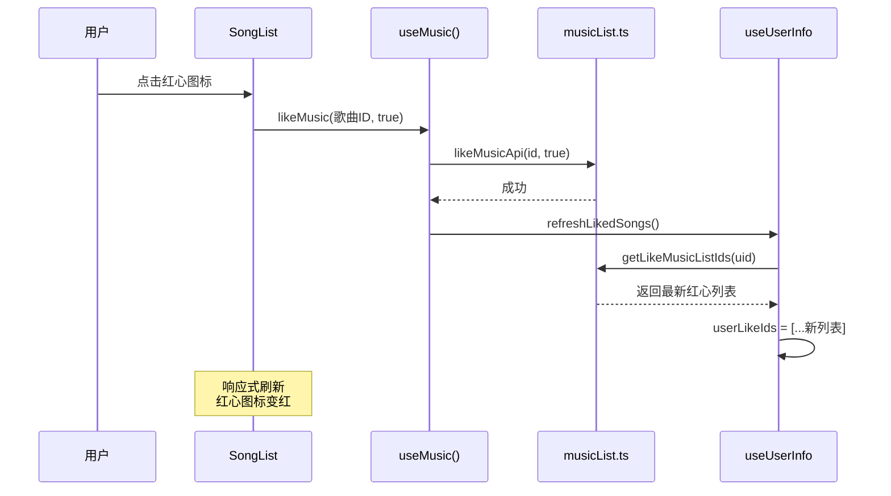

---

## 五、组件层级关系

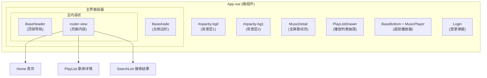

---

## 六、全局挂载与跨组件通信

### window.$audio

在 `App.vue` 中，播放器组件实例被挂载到全局 `window` 对象：

```typescript
// App.vue onMounted
window.$audio = audioInstance.value;
```

**可用属性和方法**：

| 属性/方法          | 类型               | 说明                   |
| ------------------ | ------------------ | ---------------------- |
| `el`               | `HTMLAudioElement` | 原生 audio 元素        |
| `isPlay`           | `boolean`          | 是否正在播放           |
| `play()`           | `function`         | 播放（带音量渐入效果） |
| `pause()`          | `function`         | 暂停（带音量渐出效果） |
| `reset()`          | `function`         | 重置播放器状态         |
| `cutSongHandler()` | `function`         | 切歌时重置歌词         |

**使用场景**：

```typescript
// 在任意 .ts 文件中控制播放
window.$audio.play(); // 播放
window.$audio.pause(); // 暂停
window.$audio.el.currentTime = 30; // 跳转到 30 秒
```

---

## 七、数据持久化策略

| localStorage 键   | 存储内容                           | 写入时机       | 读取时机                |
| ----------------- | ---------------------------------- | -------------- | ----------------------- |
| `IS_LOGIN`        | 登录状态 `true/false`              | 登录成功时     | App 启动时              |
| `PROFILE`         | 用户信息 JSON                      | 登录成功时     | App 启动时              |
| `userId`          | 用户 ID                            | 登录成功时     | 获取歌单时              |
| `MUSIC_CONFIG`    | 播放器状态（当前歌曲、进度、队列） | 每次切歌时     | App 启动时              |
| `ASIDE_COLLAPSED` | 侧边栏折叠状态                     | 点击折叠按钮时 | Getter 计算时           |
| `USER_SETTINGS`   | 用户设置（API 地址、字体等）       | 修改设置时     | Settings Store 初始化时 |
| `volume`          | 音量值                             | 拖动音量条时   | Store 初始化时          |

---

## 八、侧边栏配置结构

📍 **文件位置**：`layout/BaseAside/config.ts`

```typescript
// 菜单配置数组，每一项是一个"区块"
const originAsideMenuConfig: MenuConfig[] = [
  {
    title: false, // 无标题
    mark: false, // 无标记
    show: true, // 始终显示
    list: [{ name: "为我推荐", icon: "icon-home-fill", path: "/home" }],
  },
  {
    title: false,
    mark: "my", // 标记为"我的"区块
    list: [
      { name: "最近播放", path: "/lately" },
      { name: "音乐云盘", path: "/cloud" },
    ],
  },
  {
    title: "创建的歌单",
    mark: "play",
    type: "collapsed", // 可折叠类型
    isCollapsed: true, // 默认收起
    list: [], // 初始为空，后续填充
  },
  {
    title: "收藏的歌单",
    mark: "subscribedList",
    type: "collapsed",
    isCollapsed: true,
    list: [],
  },
];
```

---

## 九、总结图

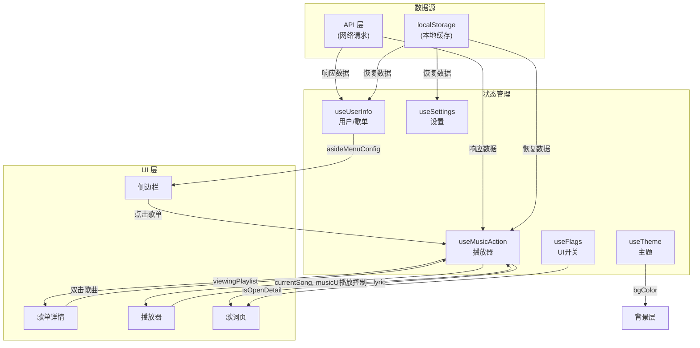

---

## 十、快速定位指南

| 我想了解...    | 应该看哪个文件                                           |
| -------------- | -------------------------------------------------------- |
| 用户如何登录   | `components/Login/index.vue` + `api/login.ts`            |
| 侧边栏如何渲染 | `layout/BaseAside/index.vue` + `store/index.ts` (Getter) |
| 歌曲如何播放   | `store/music.ts` → `getMusicUrlHandler()`                |
| 歌词如何滚动   | `utils/lyric/player.ts` + `MusicPlayer/index.vue`        |
| 红心如何生效   | `components/MusicPlayer/useMusic.ts` → `likeMusic()`     |
| 搜索如何工作   | `components/Search/` + `api/search.ts`                   |
| 背景色如何变化 | `store/theme.ts` → `change()`                            |
| 播放列表抽屉   | `components/PlayListDrawer/index.vue`                    |
