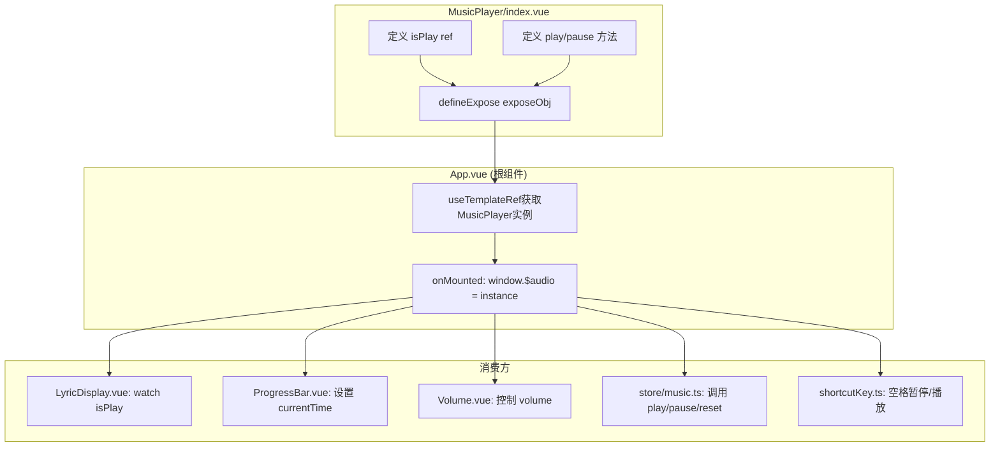

# 全局音频控制器架构解析 (`window.$audio`)

本文档深入解析本项目中实现的**全局音频控制器**设计模式，涵盖其类型定义、暴露机制、全局挂载流程以及在各模块中的实际应用场景。

---

## 1. 架构概览



---

## 2. 核心类型定义

文件: [global.d.ts](file:///d:/music-app/src/renderer/src/types/global.d.ts)

```typescript
import { MusicPlayerInstanceType } from '@/components/MusicPlayer/index.vue'

declare global {
  interface Window {
    $audio: MusicPlayerInstanceType // 全局音频控制器
  }
  var $audio: MusicPlayerInstanceType // 允许直接使用 $audio
}
```

文件: [MusicPlayer/index.vue](file:///d:/music-app/src/renderer/src/components/MusicPlayer/index.vue#L33-L40)

```typescript
export interface MusicPlayerInstanceType {
  el: UnwrapRef<userAudio> // 原生 Audio 元素（已增强）
  isPlay: UnwrapRef<boolean> // 响应式播放状态
  reset: (val: boolean) => void // 重置播放器
  pause: (isNeed?: boolean) => Promise<undefined> // 暂停（带音量渐出）
  play: () => Promise<undefined> // 播放（带音量渐入）
  resetLyricPlayer: () => void // 重置歌词播放器
}
```

> **设计亮点**：使用 `UnwrapRef<T>` 标注类型，表明这些属性是被 Vue 自动解包后的值，调用时无需 `.value`。

---

## 3. defineExpose 暴露机制

文件: [MusicPlayer/index.vue](file:///d:/music-app/src/renderer/src/components/MusicPlayer/index.vue#L278-L286)

```typescript
const exposeObj = {
  el: audio, // useTemplateRef 获取的 Audio DOM
  isPlay, // ref<boolean>
  reset,
  play,
  pause,
  resetLyricPlayer
}
defineExpose(exposeObj)
```

**原理**：

- `defineExpose` 是 Vue 3 `<script setup>` 语法中用于向父组件暴露属性的 API。
- 父组件通过模板 ref 获取子组件实例后，只能访问 `defineExpose` 显式暴露的属性。

---

## 4. 全局挂载流程

文件: [App.vue](file:///d:/music-app/src/renderer/src/App.vue#L34-L41)

```typescript
const audioInstance = useTemplateRef<MusicPlayerInstanceType>('audioInstance')

onMounted(() => {
  if (audioInstance.value !== undefined) {
    window.$audio = audioInstance.value!
    console.log('初始化全局$audio：', window.$audio)
  }
})
```

**执行时机**：

1. `MusicPlayer` 组件挂载完成，`defineExpose` 生效。
2. `App` 组件挂载完成，`audioInstance.value` 已有值。
3. 赋值给 `window.$audio`，全局可用。

---

## 5. 全局调用场景

### 5.1 播放控制 - Store

文件: [store/music.ts](file:///d:/music-app/src/renderer/src/store/music.ts#L136-L150)

```typescript
if (window.$audio) {
  window.$audio.reset(true) // 重置状态
  await window.$audio.pause(false) // 暂停旧音频
  state.value.musicUrl = data[0].url // 设置新 URL
  window.$audio.resetLyricPlayer() // 重置歌词

  window.$audio.el.oncanplay = async () => {
    await window.$audio.play() // 就绪后播放
  }
}
```

### 5.2 进度条拖动

文件: [ProgressBar.vue](file:///d:/music-app/src/renderer/src/components/MusicPlayer/ProgressBar.vue#L39)

```typescript
// 用户拖动进度条时，直接修改原生 Audio 的 currentTime
window.$audio.el.currentTime = ((val / 100) * duration) / 1000
```

### 5.3 音量控制

文件: [Volume.vue](file:///d:/music-app/src/renderer/src/components/MusicPlayer/Volume.vue#L25-L40)

```typescript
window.$audio.el.volume = volume // 设置音量
window.$audio.el.volume = model.value / 100
```

### 5.4 全局快捷键

文件: [shortcutKey.ts](file:///d:/music-app/src/renderer/src/utils/shortcutKey.ts#L18-L29)

```typescript
case 'Space':
  if (window.$audio?.isPlay) {
    window.$audio.pause()
  } else {
    window.$audio?.play()
  }
  break
case 'ArrowRight':
  window.$audio.el.currentTime += 10   // 快进10秒
  break
```

### 5.5 视频封面同步

文件: [LyricDisplay.vue](file:///d:/music-app/src/renderer/src/components/MusicDetail/LyricDisplay.vue#L126-L138)

```typescript
watch(
  () => window.$audio?.isPlay,
  (value) => {
    if (!value) {
      videoCover.value?.pause() // 音频暂停时，视频也暂停
    } else {
      videoCover.value?.play()
    }
  }
)
```

---

## 6. 方法劫持 (Monkey Patching)

文件: [MusicPlayer/index.vue](file:///d:/music-app/src/renderer/src/components/MusicPlayer/index.vue#L247-L258)

```typescript
onMounted(() => {
  // 备份原生方法
  originPlay = audio.value!.play
  originPause = audio.value!.pause

  // 覆盖为自定义方法（带音量渐变）
  audio.value!.play = play as any
  audio.value!.pause = pause as any
})
```

**设计目的**：

- 统一所有 `audio.play()` 调用都走自定义的音量渐变逻辑。
- 无论是组件内部调用还是 `window.$audio.play()`，都会触发渐变效果。

---

## 7. 响应式原理分析

**问题**：`window` 不是 Vue 响应式对象，为什么 `watch(() => window.$audio?.isPlay)` 能工作？

**答案**：

1. `window.$audio` 指向 `MusicPlayer` 暴露的 `exposeObj`。
2. `exposeObj.isPlay` 是一个 Vue `ref`。
3. 当 `isPlay.value = true` 被修改时，所有订阅了这个 ref 的 watcher 都会被通知。
4. Vue 的依赖收集是**动态**的：只要 watcher 的 getter 函数访问到了响应式属性，依赖就会被建立。

---

## 8. 架构优缺点

### 优点

| 优点           | 说明                                                |
| -------------- | --------------------------------------------------- |
| **全局可访问** | 任何组件、工具函数都可通过 `window.$audio` 控制播放 |
| **类型安全**   | 通过 `global.d.ts` 提供完整的 TS 类型支持           |
| **统一入口**   | 所有音频操作集中在 `MusicPlayer`，便于维护          |
| **响应式状态** | `isPlay` 等状态可被 Vue 追踪，支持 `watch`          |

### 潜在风险

| 风险           | 说明                                                                |
| -------------- | ------------------------------------------------------------------- |
| **初始化时序** | 子组件可能比 `App.onMounted` 更早执行，此时 `$audio` 为 `undefined` |
| **调试困难**   | 全局变量不如依赖注入 (provide/inject) 易于追踪                      |
| **测试隔离**   | 单元测试需要手动 mock `window.$audio`                               |

---

## 9. 实习项目简历亮点

> **项目亮点：全局音频控制器设计与实现**
>
> 在基于 Vue 3 + TypeScript + Electron 的音乐播放器项目中，设计并实现了一套**全局音频控制器架构**：
>
> - **技术栈**：Vue 3 Composition API、TypeScript、Pinia、GSAP
> - **核心设计**：
>   - 使用 `defineExpose` 暴露组件实例，通过 `window.$audio` 实现全局访问
>   - 采用**方法劫持 (Monkey Patching)** 增强原生 Audio API，实现音量渐入/渐出效果
>   - 利用 Vue 响应式系统，实现播放状态的跨组件同步（如视频封面、全局快捷键）
> - **性能优化**：
>   - 实现"休眠机制"，详情页隐藏时跳过 GSAP 动画和大图加载，降低 CPU/GPU 开销
>   - 使用竞态条件防御，解决快速切歌时的图片错乱问题
> - **工程实践**：
>   - 通过 `global.d.ts` 提供完整的 TypeScript 类型定义，确保全局变量类型安全
>   - 封装全局快捷键模块，支持空格暂停/播放、方向键快进/后退
>
> 该设计使得播放控制逻辑高度复用，支持 10+ 个模块共享同一音频实例，显著提升了开发效率和代码可维护性。

---

## 10. 一句话总结

> 基于 Vue 3 的 `defineExpose` 机制，将播放器组件实例暴露并挂载至 `window.$audio`，实现全局访问；同时采用**方法劫持 (Monkey Patching)** 增强原生 Audio API，无缝注入音量渐变逻辑——任何模块调用 `play()` / `pause()` 均自动触发淡入淡出效果，使播放控制逻辑高度解耦、10+ 个模块共享同一实例，兼顾了开发便捷性与用户体验。
